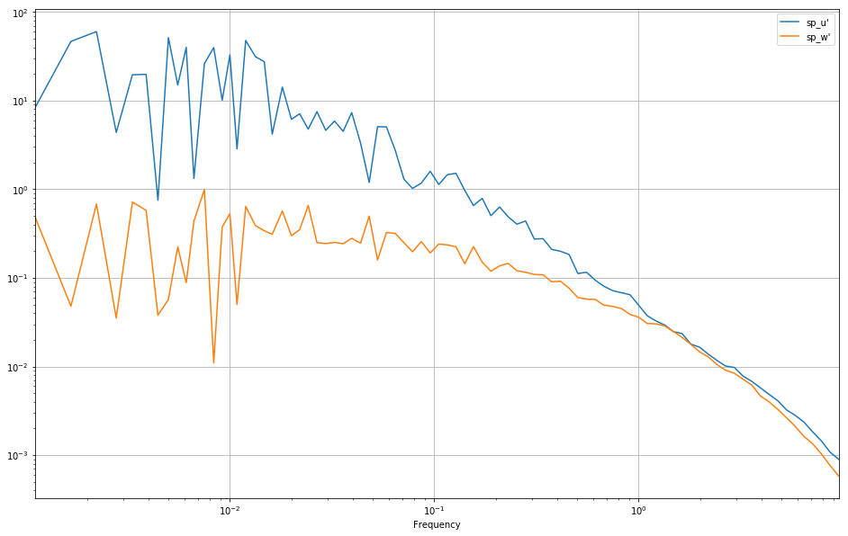

\begin{block}{Preamble}

```python
import pymicra as pm
import pandas as pd
from glob import glob
import matplotlib.pyplot as plt

fconfig = pm.fileConfig('tij_pr_qc.config')
```
\end{block}

\begin{block}{Quality control}

```python
fnames = sorted(glob('mydata/*.out'))
pm.util.qc_replace(fnames, fconfig,
    file_lines=36000,
    lower_limits=dict(theta_v=10, mrho_h2o=0, mrho_co2=0),
    upper_limits=dict(theta_v=45),
    spikes_test=True,
    max_replacement_count=360, # replacement count test
    chunk_size=1200,
    outdir='out1',
    replaced_report='rrep.txt')

fnames2 = sorted(glob('out1/*.out'))
pm.util.qc_discard(fnames2, fconfig,
    std_limits = dict(u=0.03, v=0.03, w=0.01, theta_v=0.02),
    dif_limits = dict(u=4.0, v=4.0, w=1.0, theta_v=2.0),
    chunk_size=1200,
    outdir='out2',
    summary_file='discard_summary.csv',
    full_report='frep.txt')

```

    20110224-1220.out
    Passed all tests
    Re-writing mydata/20110224-1220.out
    
    20110224-1250.out
    Passed all tests
    Re-writing mydata/20110224-1250.out
    
    20110224-1340.out
    Passed all tests
    Re-writing mydata/20110224-1340.out
    
    20110224-1410.out
    Passed all tests
    Re-writing mydata/20110224-1410.out
    
    20110224-1440.out
    Passed all tests
    Re-writing mydata/20110224-1440.out
    
    20110224-1510.out
    Passed all tests
    Re-writing mydata/20110224-1510.out
    
    20110224-1610.out
    Passed all tests
    Re-writing mydata/20110224-1610.out
    
    20110224-1640.out
    Passed all tests
    Re-writing mydata/20110224-1640.out
    
                               control  percent
    total                            8    100.0
    failed lines test                0      0.0
    failed replacement test          0      0.0
    passed all tests                 8    100.0
    Runs with replaced nans          0      0.0
    Runs with replaced bound         0      0.0
    Runs with replaced spikes        8    100.0
    20110224-1220.out
    20110224-1220.out : !FAILED failed maxdif test test!
    
    Failed variable(s): theta_v, u 
    
    20110224-1250.out
    20110224-1250.out : !FAILED failed maxdif test test!
    
    Failed variable(s): theta_v 
    
    20110224-1340.out
    Passed all tests
    Re-writing out1/20110224-1340.out
    
    20110224-1410.out
    20110224-1410.out : !FAILED failed maxdif test test!
    
    Failed variable(s): theta_v 
    
    20110224-1440.out
    Passed all tests
    Re-writing out1/20110224-1440.out
    
    20110224-1510.out
    20110224-1510.out : !FAILED failed maxdif test test!
    
    Failed variable(s): theta_v 
    
    20110224-1610.out
    20110224-1610.out : !FAILED failed maxdif test test!
    
    Failed variable(s): theta_v 
    
    20110224-1640.out
    Passed all tests
    Re-writing out1/20110224-1640.out
    
                        control  percent
    total                     8    100.0
    failed STD test           0      0.0
    failed maxdif test        5     62.5
    passed all tests          3     37.5


<div>
<style>
    .dataframe thead tr:only-child th {
        text-align: right;
    }

    .dataframe thead th {
        text-align: left;
    }

    .dataframe tbody tr th {
        vertical-align: top;
    }
</style>
<table border="1" class="dataframe">
  <thead>
    <tr style="text-align: right;">
      <th></th>
      <th>passed all tests</th>
      <th>total</th>
      <th>failed STD test</th>
      <th>failed maxdif test</th>
    </tr>
  </thead>
  <tbody>
    <tr>
      <th>0</th>
      <td>NaN</td>
      <td>20110224-1220.out</td>
      <td>NaN</td>
      <td>20110224-1220.out</td>
    </tr>
    <tr>
      <th>1</th>
      <td>NaN</td>
      <td>20110224-1250.out</td>
      <td>NaN</td>
      <td>20110224-1250.out</td>
    </tr>
    <tr>
      <th>2</th>
      <td>20110224-1340.out</td>
      <td>20110224-1340.out</td>
      <td>NaN</td>
      <td>NaN</td>
    </tr>
    <tr>
      <th>3</th>
      <td>NaN</td>
      <td>20110224-1410.out</td>
      <td>NaN</td>
      <td>20110224-1410.out</td>
    </tr>
    <tr>
      <th>4</th>
      <td>20110224-1440.out</td>
      <td>20110224-1440.out</td>
      <td>NaN</td>
      <td>NaN</td>
    </tr>
    <tr>
      <th>5</th>
      <td>NaN</td>
      <td>20110224-1510.out</td>
      <td>NaN</td>
      <td>20110224-1510.out</td>
    </tr>
    <tr>
      <th>6</th>
      <td>NaN</td>
      <td>20110224-1610.out</td>
      <td>NaN</td>
      <td>20110224-1610.out</td>
    </tr>
    <tr>
      <th>7</th>
      <td>20110224-1640.out</td>
      <td>20110224-1640.out</td>
      <td>NaN</td>
      <td>NaN</td>
    </tr>
  </tbody>
</table>
</div>


\end{block}

\begin{block}{Pre-processing and calculation of fluxes}

```python
fconfig = pm.fileConfig('tij_pr.config')
sconfig = pm.siteConfig('tij_pr.site')
fnames = sorted(glob('out2/*out'))
allresults=[]

for fname in fnames:
    data, units = pm.timeSeries(fname, fconfig, parse_dates=False)
    data = pm.micro.preProcess(data, units, solutes=['co2'])
    fulldata = data.detrend(units=units, ignore=['p'], join_data=True)

    results = pm.micro.eddyCovariance(fulldata, units, site_config=sconfig, 
                                      wpl=True, solutes=['co2'])
    allresults.append(results)

allresults = pd.concat(allresults, ignore_index=True)

```

    Beginning of pre-processing ...
    Rotating data with 2d method ... Done!
    Converting theta_v to kelvin ... Done!
    Didn't locate mass density of h2o. Trying to calculate it ... Done!
    Moist air density not present in dataset
    Calculating rho_air = p/(Rdry * theta_v) ... Done!
    Calculating dry_air mass_density = rho_air - rho_h2o ... Done!
    Dry air molar density not in dataset
    Calculating dry_air molar_density = rho_dry / dry_air_molar_mass ... Done!
    Calculating specific humidity = rho_h2o / rho_air ... Done!
    Calculating h2o mass mixing ratio = rho_h2o / rho_dry ... Done!
    Calculating h2o molar mixing ratio = rho_h2o / rho_dry ... Done!
    Thermodynamic temperature not found ... trying to calculate it with theta_v ~ theta (1 + 0.61 q) relation ... done!
    Didn't locate mass density of co2. Trying to calculate it ... Done!
    Calculating co2 mass concentration (g/g) = rho_co2 / rho_air ... Done!
    Calculating co2 mass mixing ratio = rho_co2 / rho_dry ... Done!
    Calculating co2 molar mixing ratio = mrho_co2 / mrho_dry ... Done!
    Pre-processing complete.
    
    Beginning Eddy Covariance method...
    Fluctuations of theta not found. Will try to calculate it with theta' = (theta_v' - 0.61 theta_mean q')/(1 + 0.61 q_mean ... done!
    Calculating fluxes from covariances ... done!
    Applying WPL correction for water vapor flux ... done!
    Applying WPL correction for latent heat flux using result for water vapor flux ... done!
    Re-calculating cov(mrho_h2o', w') according to WPL correction ... done!
    Applying WPL correction for F_co2 ... done!
    Re-calculating cov(mrho_co2', w') according to WPL correction ... done!
    Beginning to extract turbulent scales...
    Data seems to be covariances. Will it use as covariances ...
    Calculating the turbulent scales of wind, temperature and humidity ... done!
    Calculating the turbulent scale of co2 ... done!
    Calculating Obukhov length and stability parameter ... done!
    Calculating turbulent scales of mass concentration ... done!
    Done with Eddy Covariance.
    
    Beginning of pre-processing ...
    Rotating data with 2d method ... Done!
    Converting theta_v to kelvin ... Done!
    Didn't locate mass density of h2o. Trying to calculate it ... Done!
    Moist air density not present in dataset
    Calculating rho_air = p/(Rdry * theta_v) ... Done!
    Calculating dry_air mass_density = rho_air - rho_h2o ... Done!
    Dry air molar density not in dataset
    Calculating dry_air molar_density = rho_dry / dry_air_molar_mass ... Done!
    Calculating specific humidity = rho_h2o / rho_air ... Done!
    Calculating h2o mass mixing ratio = rho_h2o / rho_dry ... Done!
    Calculating h2o molar mixing ratio = rho_h2o / rho_dry ... Done!
    Thermodynamic temperature not found ... trying to calculate it with theta_v ~ theta (1 + 0.61 q) relation ... done!
    Didn't locate mass density of co2. Trying to calculate it ... Done!
    Calculating co2 mass concentration (g/g) = rho_co2 / rho_air ... Done!
    Calculating co2 mass mixing ratio = rho_co2 / rho_dry ... Done!
    Calculating co2 molar mixing ratio = mrho_co2 / mrho_dry ... Done!
    Pre-processing complete.
    
    Beginning Eddy Covariance method...
    Fluctuations of theta not found. Will try to calculate it with theta' = (theta_v' - 0.61 theta_mean q')/(1 + 0.61 q_mean ... done!
    Calculating fluxes from covariances ... done!
    Applying WPL correction for water vapor flux ... done!
    Applying WPL correction for latent heat flux using result for water vapor flux ... done!
    Re-calculating cov(mrho_h2o', w') according to WPL correction ... done!
    Applying WPL correction for F_co2 ... done!
    Re-calculating cov(mrho_co2', w') according to WPL correction ... done!
    Beginning to extract turbulent scales...
    Data seems to be covariances. Will it use as covariances ...
    Calculating the turbulent scales of wind, temperature and humidity ... done!
    Calculating the turbulent scale of co2 ... done!
    Calculating Obukhov length and stability parameter ... done!
    Calculating turbulent scales of mass concentration ... done!
    Done with Eddy Covariance.
    
    Beginning of pre-processing ...
    Rotating data with 2d method ... Done!
    Converting theta_v to kelvin ... Done!
    Didn't locate mass density of h2o. Trying to calculate it ... Done!
    Moist air density not present in dataset
    Calculating rho_air = p/(Rdry * theta_v) ... Done!
    Calculating dry_air mass_density = rho_air - rho_h2o ... Done!
    Dry air molar density not in dataset
    Calculating dry_air molar_density = rho_dry / dry_air_molar_mass ... Done!
    Calculating specific humidity = rho_h2o / rho_air ... Done!
    Calculating h2o mass mixing ratio = rho_h2o / rho_dry ... Done!
    Calculating h2o molar mixing ratio = rho_h2o / rho_dry ... Done!
    Thermodynamic temperature not found ... trying to calculate it with theta_v ~ theta (1 + 0.61 q) relation ... done!
    Didn't locate mass density of co2. Trying to calculate it ... Done!
    Calculating co2 mass concentration (g/g) = rho_co2 / rho_air ... Done!
    Calculating co2 mass mixing ratio = rho_co2 / rho_dry ... Done!
    Calculating co2 molar mixing ratio = mrho_co2 / mrho_dry ... Done!
    Pre-processing complete.
    
    Beginning Eddy Covariance method...
    Fluctuations of theta not found. Will try to calculate it with theta' = (theta_v' - 0.61 theta_mean q')/(1 + 0.61 q_mean ... done!
    Calculating fluxes from covariances ... done!
    Applying WPL correction for water vapor flux ... done!
    Applying WPL correction for latent heat flux using result for water vapor flux ... done!
    Re-calculating cov(mrho_h2o', w') according to WPL correction ... done!
    Applying WPL correction for F_co2 ... done!
    Re-calculating cov(mrho_co2', w') according to WPL correction ... done!
    Beginning to extract turbulent scales...
    Data seems to be covariances. Will it use as covariances ...
    Calculating the turbulent scales of wind, temperature and humidity ... done!
    Calculating the turbulent scale of co2 ... done!
    Calculating Obukhov length and stability parameter ... done!
    Calculating turbulent scales of mass concentration ... done!
    Done with Eddy Covariance.
    

\end{block}

\begin{block}{Results are easy to visualize}

```python
data.with_units(units).mean()
```


    mrho_h2o  <millimole / meter ** 3>    1.302782e+03
    p         <kilopascal>                9.139658e+01
    mrho_co2  <millimole / meter ** 3>    1.325734e+01
    theta_v   <kelvin>                    2.983157e+02
    u         <meter / second>            3.854082e+00
    v         <meter / second>            9.685296e-15
    w         <meter / second>            4.837303e-16
    rho_h2o   <kilogram / meter ** 3>     2.347000e-02
    rho_air   <kilogram / meter ** 3>     1.067299e+00
    rho_dry   <kilogram / meter ** 3>     1.043829e+00
    mrho_dry  <mole / meter ** 3>         3.603822e+01
    q         <dimensionless>             2.199023e-02
    r_h2o     <dimensionless>             2.248509e-02
    mr_h2o    <dimensionless>             3.615090e-02
    theta     <kelvin>                    2.943670e+02
    rho_co2   <kilogram / meter ** 3>     5.834487e-04
    conc_co2  <dimensionless>             5.466587e-04
    r_co2     <dimensionless>             5.589473e-04
    mr_co2    <dimensionless>             3.678667e-04
    dtype: float64


```python
allresults.with_units(units).mean()
```


    tau            <kilogram / meter / second ** 2>       0.065194
    H              <watt / meter ** 2>                  -16.633111
    Hv             <watt / meter ** 2>                   -3.660275
    E              <millimole / meter ** 2 / second>      4.111622
    LE             <watt / meter ** 2>                  181.147458
    F_co2          <millimole / meter ** 2 / second>     -0.012895
    u_star         <meter / second>                       0.224305
    theta_v_star   <kelvin>                              -0.019376
    theta_star     <kelvin>                              -0.085274
    mrho_h2o_star  <millimole / meter ** 3>              22.130035
    mrho_co2_star  <millimole / meter ** 3>              -0.069315
    Lo             <meter>                              641.361650
    zeta           <dimensionless>                        0.019382
    q_star         <dimensionless>                        0.000376
    conc_co2_star  <dimensionless>                       -0.000003
    dtype: float64


```python
data[['u', 'v', 'w']].plot(figsize=(16,10))
plt.show()
```


\end{block}

\begin{block}{Easy to generate results}

```python
uw_spectra = pm.spectra(fulldata[["u'", "w'"]], frequency=20, anti_aliasing=True)
uw_spectra.binned(bins_number=100).plot(loglog=True, grid=True, figsize=(16,10))
plt.show()
```




\end{block}